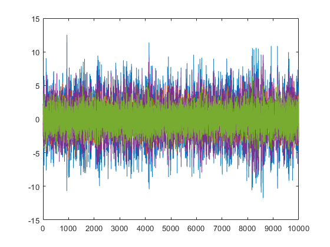
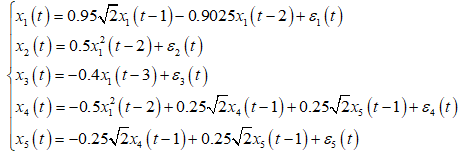
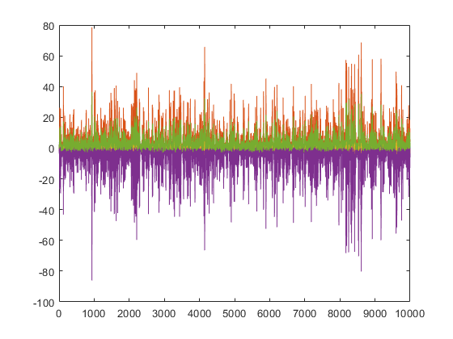
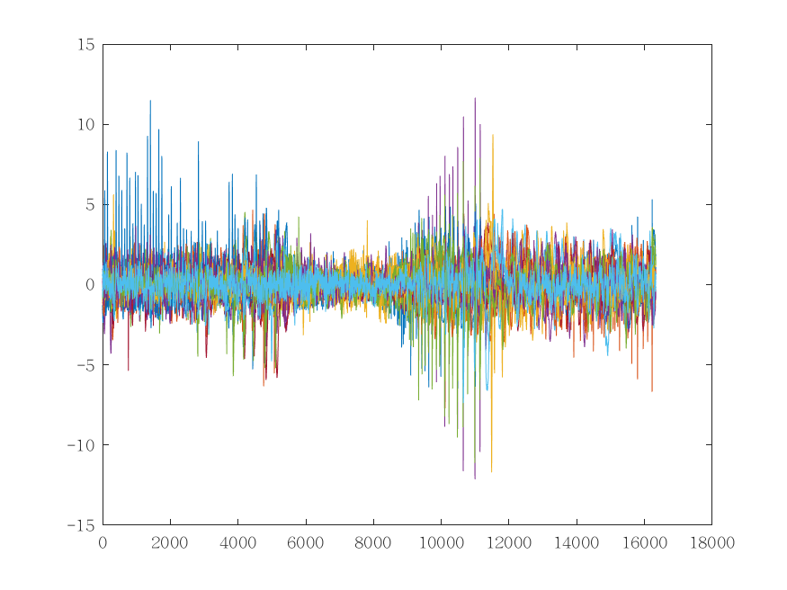
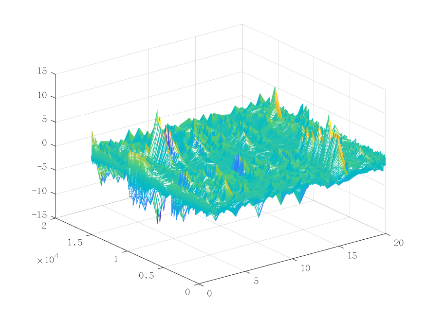
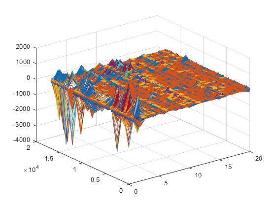

# Deep Learning for Time Series

```
Email: autuanliu@163.com
```
- [Deep Learning for Time Series](#deep-learning-for-time-series)
    - [1 RNN Granger Causality](#1-rnn-granger-causality)
        - [1.1 Granger Causality Definition$^1$](#11-granger-causality-definition1)
        - [1.2 Simulation Model](#12-simulation-model)
        - [1.3 EEG Signals](#13-eeg-signals)
        - [1.4 EEG64s Signals](#14-eeg64s-signals)
        - [1.5 EEG72s Signals](#15-eeg72s-signals)
        - [1.6 Network](#16-network)
    - [Theory](#theory)
    - [Docs](#docs)
    - [Reference](#reference)
    - [Useful website](#useful-website)
  
## 1 RNN Granger Causality
### 1.1 Granger Causality Definition$^1$
Suppose $x$ is a stationary multivariate time series. Multivariate Granger causality analysis is estimated by fitting a vector autoregressive model (VAR) to the time series with time lag of $P$ :

$$
\tag{1}\vec x(t)=\sum_{p=1}^P A_p \vec x(t-p)+bias+\epsilon(t)
$$

where $A$ is the coefficient matrix, $bias$ is a vector and $\epsilon(t)$ is Gaussian noise. A time series $x_i$ is a Granger cause of $x_j$, if $x_i$ is significantly contributed in prediction of $x_j$. To quantitatively measure the contribution, we fit another VAR as follows:

$$
\tag{2}\vec x_{\backslash x_i}(t)=\sum_{p^\star=1}^{P^\star} A_{p\star}^\star \vec x_{\backslash x_i}(t-p^\star)+bias^\star+\epsilon_{\backslash x_i}^\star(t)
$$

where $A^\star$ is the model coefficients, $bias^\star$ is a vector, $\epsilon_{\backslash x_i}^\star(t)$ is Gaussian noise, and $\vec x_{\backslash x_i}(t)$ is a vector without containing $x_i$. Then we could define the Granger causality from $x_i$ to $x_j$ as:

$$
\tag{3}G_{x_i\rightarrow x_j}=\ln\frac{var{\epsilon_{x_j\backslash x_i}^\star(t)}}{var{\epsilon_{x_j}(t)}}
$$

### 1.2 Simulation Model
1. Linear model
    * formula
  
    
    * signals
  
    
    * Granger Causality Matrix
    
    

2. NonLinear model
    * formula
  
    
    * signals
  
    
    * Granger Causality Matrix
    
    

3. Long-lag NonLinear model
    * formula
  
    
    * signals
  
    
    * Granger Causality Matrix
    
    

### 1.3 EEG Signals
* signals


* Granger Causality Matrix
    


### 1.4 EEG64s Signals
* signals



* Granger Causality Matrix
    


### 1.5 EEG72s Signals
* signals



* Granger Causality Matrix
    


### 1.6 Network


## Theory
1. **Wang, Y., Lin, K., Qi, Y., Lian, Q., Feng, S., Wu, Z., & Pan, G. (2018). Estimating Brain Connectivity With Varying-Length Time Lags Using a Recurrent Neural Network. IEEE Transactions on Biomedical Engi-neering, 65, 1953-1963.**
2. **Montalto, A., Stramaglia, S., Faes, L., Tessitore, G., Prevete, R., & Marinazzo, D. (2015). Neural networks with non-uniform embedding and explicit validation phase to assess granger causality. Neural Net-works,71(C), 159-171.**
3. Gómez-García J A, Godino-Llorente J I, Castellanos-Dominguez G. Non uniform Embedding based on Relevance Analysis with reduced computational complexity: Application to the detection of pathologies from biosignal recordings[J]. Neurocomputing, 2014, 132(7):148-158.
4. **Smith, L. N. (2015). Cyclical learning rates for training neural networks. Computer Science, 464-472.**
5. **Loshchilov, I., & Hutter, F. (2016). Sgdr: stochastic gradient descent with warm restarts.**

## Docs
1. [深度学习在EEG数据的应用探索以及实验](./Docs/深度学习在EEG数据的应用探索以及实验NickName.pdf)

## Reference
1. [RNN-GC](https://github.com/shaozhefeng/RNN-GC)
2. [Deep Learning for Time Series Classification](https://github.com/hfawaz/dl-4-tsc)

* Notes
> The code is for research use only.

## Useful website
1. [explainshell.com - match command-line arguments to their help text](https://explainshell.com/)
